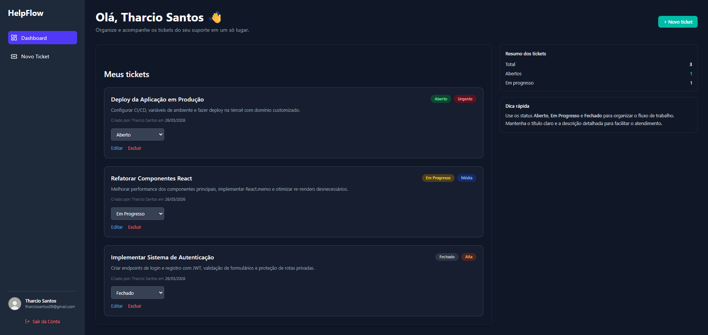
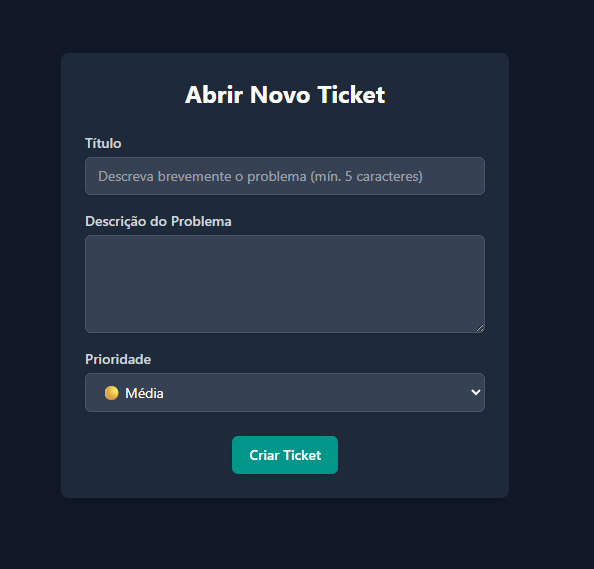
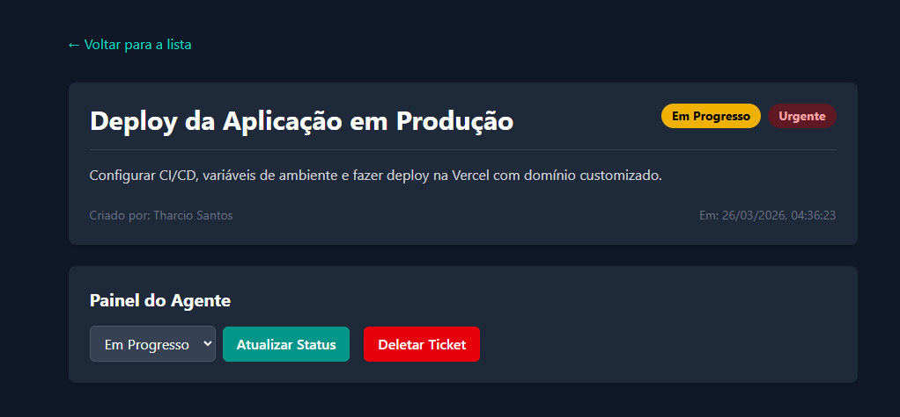

# HelpFlow

Sistema de help desk full-stack com autenticação híbrida, RBAC e gestão de tickets construído com Next.js, Prisma e PostgreSQL.

## Visão Geral

O HelpFlow foi pensado para centralizar a abertura, o acompanhamento e a atualização de chamados em uma interface simples. A aplicação combina autenticação por credenciais e GitHub OAuth, com autorização aplicada no servidor para proteger rotas e operações sensíveis.

Aplicação em produção: [helpflow.vercel.app](https://helpflow.vercel.app/)

## Preview

### Dashboard


### Criação de ticket


### Detalhes do ticket


## Funcionalidades

- Autenticação com email e senha usando `bcryptjs`
- Login social com GitHub via `next-auth`
- Controle de acesso por papel com distinção entre `CLIENT` e `AGENT`
- Criação de tickets com **título**, **descrição** e **prioridade** (Baixa, Média, Alta, Urgente)
- Edição completa de tickets: título, descrição, status e prioridade
- Atualização de status diretamente na listagem do dashboard
- Exclusão de tickets com confirmação
- Dashboard com listagem paginada e resumo de status
- Validação de dados com `Zod` nas rotas de API
- Rate limiting nas rotas de autenticação e cadastro para proteção contra brute force
- Testes E2E com Cypress cobrindo autenticação, tickets e permissões

## Regras de acesso

- `CLIENT` cria tickets, visualiza os próprios chamados e pode editar ou remover os tickets que abriu
- `AGENT` visualiza todos os tickets e pode editar, atualizar status e excluir qualquer chamado
- A autorização é validada nas rotas da API com base em `role` e `ownership`; a interface apenas reflete essas permissões

## Stack

- `Next.js 15` com App Router
- `React 19`
- `Tailwind CSS 4`
- `NextAuth.js`
- `Prisma`
- `PostgreSQL`
- `Zod`
- `Cypress`
- `Vercel`

## Estrutura do projeto

```text
src/
  app/
    (auth)/           telas de login e cadastro
    (dashboard)/      dashboard, criação e edição de tickets
    api/              autenticação, cadastro, tickets, health e keep-alive
    components/       componentes reutilizáveis da interface
  lib/
    prisma.js         cliente Prisma singleton
    schemas.js        schemas de validação Zod (tickets, registro)
    ticketUtils.js    funções utilitárias de status e prioridade
    rateLimiter.js    rate limiter em memória para proteção de rotas
prisma/
  schema.prisma       modelos e enums do banco
cypress/
  e2e/                testes end-to-end (auth, tickets, permissions)
  support/            comandos customizados do Cypress
public/
  *.PNG               imagens usadas no README
```

## Como rodar localmente

### 1. Clone o repositório

```bash
git clone https://github.com/tharciosantos/helpflow.git
cd helpflow
```

### 2. Instale as dependências

```bash
npm install
```

### 3. Configure o ambiente

Crie o arquivo `.env` a partir de `.env.example`:

```bash
cp .env.example .env
```

Preencha as variáveis:

```env
AUTH_GITHUB_ID=
AUTH_GITHUB_SECRET=
NEXTAUTH_URL=http://localhost:3000
NEXTAUTH_SECRET=
DATABASE_URL=
DIRECT_URL=
CYPRESS_TEST_SECRET=   # necessário apenas para rodar os testes Cypress
```

### 4. Prepare o banco

```bash
npx prisma migrate dev
npx prisma generate
```

> **Atenção no Windows:** pare o servidor Next.js antes de rodar migrations para evitar o erro `EPERM` no Prisma Client.

### 5. Inicie a aplicação

```bash
npm run dev
```

Aplicação local: [http://localhost:3000](http://localhost:3000)

## Testes

### Testes E2E (Cypress)

Antes de rodar os testes E2E, certifique-se de que `CYPRESS_TEST_SECRET` está definido no `.env`:

```env
CYPRESS_TEST_SECRET=algum-valor-seguro-qualquer
```

> O valor deve ser o mesmo em `.env` (lido pela API) e disponível no ambiente onde o Cypress roda. O `cypress.config.js` lê essa variável via `process.env.CYPRESS_TEST_SECRET`.

Para rodar os testes:

```bash
npx cypress open   # modo interativo
npx cypress run    # modo headless (CI)
```

Os testes cobrem:
- Criação de conta e login com credenciais válidas e inválidas
- Criação, edição e exclusão de tickets
- Controle de permissões entre `CLIENT` e `AGENT`
- Proteção das rotas de API (401 sem sessão)

> Os testes criam usuários dinamicamente via `/api/register` — não é necessário seed manual no banco.
> Os testes de permissão que criam usuários `AGENT` dependem de `CYPRESS_TEST_SECRET` estar configurado.

### Testes Unitários (Vitest)

```bash
npm test                # roda uma vez
npm run test:watch      # modo watch — re-roda ao salvar
npm run test:coverage   # relatório de cobertura
```

Os testes unitários cobrem os schemas Zod (`schemas.js`) e os utilitários de display (`ticketUtils.js`).

## OAuth com GitHub

Configure uma OAuth App no GitHub com os callbacks:

- Local: `http://localhost:3000/api/auth/callback/github`
- Produção: `https://helpflow.vercel.app/api/auth/callback/github`

Se não quiser usar login social, basta deixar `AUTH_GITHUB_ID` e `AUTH_GITHUB_SECRET` vazios.

## Scripts

- `npm run dev` inicia o ambiente de desenvolvimento
- `npm run build` gera o build de produção
- `npm run start` sobe o build gerado
- `npm run lint` executa o ESLint
- `npx cypress open` abre o Cypress para testes E2E

## Observações técnicas

- A sessão usa estratégia `jwt`, com `id` e `role` propagados para o token e para `session.user`
- O papel padrão criado no cadastro é `CLIENT`
- As rotas protegidas usam `getServerSession` para validar autenticação antes de acessar ou alterar tickets
- A validação de entrada nas rotas de API é feita com `Zod`, retornando erros detalhados por campo
- O rate limiter é baseado em memória (Map) — funciona em instância única; para ambientes distribuídos, substituir por Redis (ex: Upstash)
- Existe uma rota de `health` e um endpoint de `keep-alive` para suporte operacional

## Documentação adicional

- Guia de desenvolvimento local: `DEVELOPMENT.md`

## Contato

Tharcio Santos  
[LinkedIn](https://www.linkedin.com/in/tharcio-santos/)  
[tharciosantos09@gmail.com](mailto:tharciosantos09@gmail.com)
