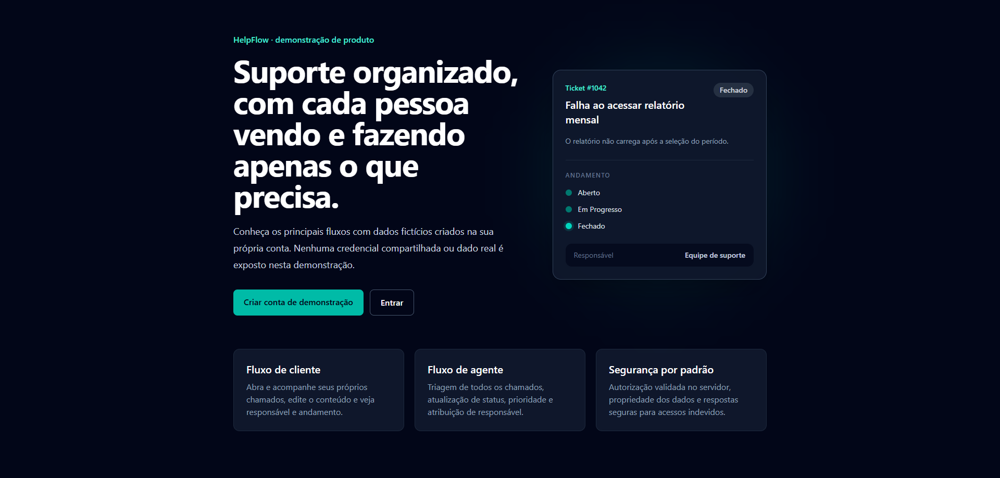
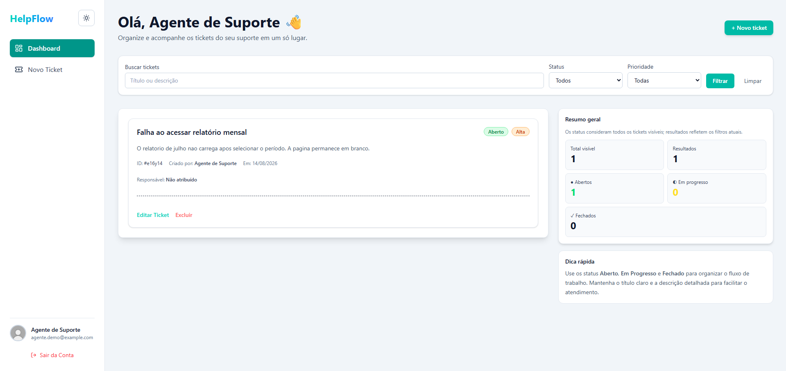
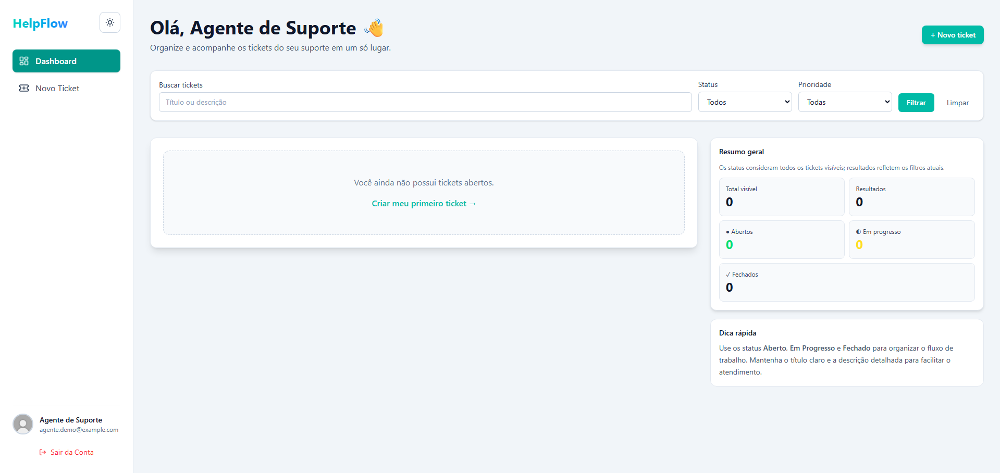
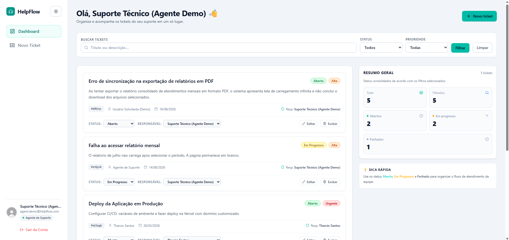
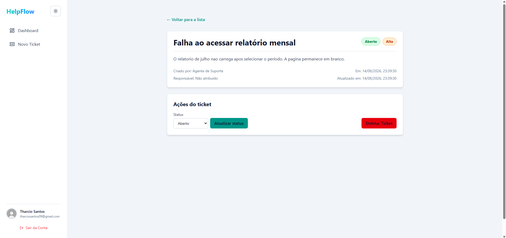
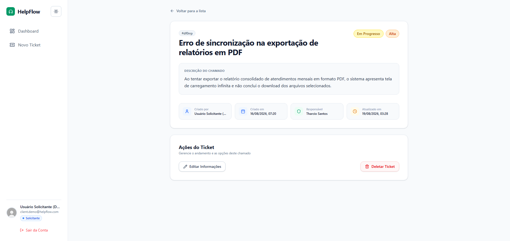

# HelpFlow

Sistema de help desk para abertura, acompanhamento e gerenciamento de chamados. O projeto reúne autenticação por credenciais e GitHub, controle de acesso por perfil, persistência de dados com Prisma e PostgreSQL, além de experiência responsiva com tema claro/escuro persistido.

## Status do projeto

**Em evolução contínua, com versão disponível em produção.**

As principais funcionalidades de autenticação, autorização e gestão de tickets estão implementadas. Melhorias de infraestrutura, observabilidade e ampliação dos testes permanecem planejadas.

## Objetivo do projeto

O HelpFlow foi criado para praticar o desenvolvimento de uma aplicação full stack baseada em um fluxo real de suporte. O sistema centraliza a abertura e o acompanhamento de tickets, diferenciando as permissões de clientes e agentes.

O projeto também tem como foco o aprendizado de autenticação, autorização no servidor, modelagem de dados relacionais, validação de entradas, testes automatizados e deploy.

## Demonstração

- **Aplicação em produção:** [https://helpflow.vercel.app/](https://helpflow.vercel.app/)
- **Repositório:** [https://github.com/tharciosantos/helpflow](https://github.com/tharciosantos/helpflow)

A aplicação conta com **Acesso de Demonstração (1-Clique)** diretamente na tela de login, permitindo explorar os dois fluxos do sistema com rapidez:
- 👤 **Solicitante (`CLIENT`):** `client.demo@helpflow.com` — fluxo do usuário final com abertura, edição e acompanhamento de tickets próprios.
- 🛡️ **Agente (`AGENT`):** `agent.demo@helpflow.com` — fluxo de suporte com visão de todos os tickets da empresa, alteração de status/prioridade e resolução de chamados.

Além disso, cada visitante pode criar sua própria conta individual pelo fluxo padrão de cadastro com dados fictícios.

### Apresentação pública



### Tela de login


### Dashboard do cliente



### Dashboard do cliente vazio



### Dashboard do agente



### Detalhes e ações do ticket





## Funcionalidades implementadas

### Autenticação e segurança

- Cadastro e login com e-mail e senha.
- Armazenamento de senhas com hash gerado por `bcryptjs`.
- Validação de `confirmPassword` no backend durante o registro.
- Mensagens de erro genéricas em todas as falhas de autenticação (sem enumeração de usuários).
- Desativação de `allowDangerousEmailAccountLinking` no provedor GitHub.
- Login social com GitHub por meio do NextAuth.js.
- Sessões baseadas em JWT, com `id` e `role` disponíveis na sessão do usuário.
- Rate limiter em memória com limpeza automática de entradas expiradas, aplicado nas rotas de login, cadastro e operações de criação, atualização e exclusão de tickets.
- Validação de entradas com Zod nas rotas de cadastro e tickets.
- Headers de segurança HTTP: `X-Frame-Options`, `X-Content-Type-Options`, `Referrer-Policy`, `Permissions-Policy`, `X-DNS-Prefetch-Control` e `Content-Security-Policy-Report-Only`.
- Resposta da rota de registro limitada a `id`, `name` e `email`, sem expor campos internos como `role` ou `auth_provider`.
- Health check que não expõe mensagens de erro internas do banco.

### Controle de acesso

- Controle de acesso baseado nos perfis `CLIENT` e `AGENT`.
- Validação de autenticação, perfil e propriedade do ticket nas rotas da API.
- Usuários `CLIENT` podem criar tickets, visualizar os próprios chamados, editar título e descrição e excluir os tickets que abriram.
- Usuários `CLIENT` não podem alterar status, prioridade ou responsável, inclusive por requisições manipuladas diretamente contra a API.
- Usuários `AGENT` podem visualizar todos os tickets e gerenciar conteúdo, status, prioridade, responsável e exclusão.
- Novos usuários cadastrados recebem o perfil `CLIENT` por padrão.

#### Matriz de permissões

| Operação | CLIENT proprietário | CLIENT não proprietário | AGENT |
| --- | --- | --- | --- |
| Criar ticket | Sim | Sim | Sim |
| Listar/visualizar | Próprios | Não | Todos |
| Editar título/descrição | Sim | Não | Sim |
| Alterar status/prioridade | Não | Não | Sim |
| Atribuir responsável | Não | Não | Sim |
| Excluir | Sim | Não | Sim |

As decisões são aplicadas nas rotas da API; ocultar controles na interface é apenas uma camada adicional de experiência.

### Gestão de tickets

- Criação de tickets com título, descrição e prioridade.
- Prioridades disponíveis: baixa, média, alta e urgente.
- Estados disponíveis: aberto, em progresso e fechado.
- Edição de título, descrição, status e prioridade.
- Atualização de status diretamente pelo dashboard e pela página de detalhes do ticket.
- Exclusão de tickets com confirmação.
- Listagem paginada de chamados.
- Indicadores com resumo dos tickets por status, calculados pela API com base na visibilidade do usuário.

### Recuperação de senha

- Página de solicitação de recuperação com formulário de email.
- Geração de token seguro (256 bits de entropia) com expiração de 15 minutos.
- Envio de email de recuperação via Nodemailer com template HTML.
- Página de redefinição de senha com validação do token.
- Rate limiter na rota de solicitação para prevenir abuso.
- Mensagem genérica de resposta para prevenir enumeração de usuários.
- Transação atômica para atualizar a senha e marcar o token como utilizado.

### Suporte operacional

- Endpoint de health check para verificar a comunicação com o banco de dados.
- Endpoint protegido de keep-alive configurado no Vercel Cron para execução periódica.

### Experiência e tema

- Tema claro/escuro com persistência conjunta em cookie e `localStorage`.
- Tema renderizado no servidor (SSR baseado no cookie `helpflow-theme`): o `<html>` já sai com a classe correta, eliminando o flash (FOUC) em recargas.
- Script de inicialização no `<head>` detecta preferência salva, cookie ou `prefers-color-scheme` do sistema no primeiro acesso.
- Sincronização entre abas via evento `storage` do navegador.
- Responsividade mobile em todas as telas: menu hamburger com sidebar deslizante no dashboard, formulários empilhados e landing otimizada para dispositivos móveis.
- Animações de scroll reveal com `Intersection Observer`, respeitando `prefers-reduced-motion`.
- Acessibilidade: foco visível, `aria-labels`, estados de carregamento/erro anunciáveis e micro-interações com `transition`.

## Tecnologias utilizadas

### Front-end

- Next.js 15 com App Router
- React 19
- Tailwind CSS 4
- React Icons

### Back-end e autenticação

- Route Handlers do Next.js
- NextAuth.js
- Prisma Adapter para NextAuth.js
- bcryptjs
- Nodemailer
- Zod

### Banco de dados

- PostgreSQL
- Supabase como serviço de hospedagem do banco
- Prisma ORM

### Testes e qualidade

- Vitest
- Cypress
- ESLint

### Deploy e operação

- Vercel
- Vercel Cron Jobs

> As dependências do Upstash estão instaladas no projeto, mas o rate limiter utilizado atualmente é baseado em memória com limpeza de entradas expiradas. Não é ideal para ambientes serverless distribuídos — a substituição por Redis está planejada.

## Estrutura geral do projeto

```text
src/
├── app/
│   ├── (auth)/              # Páginas de login, cadastro e recuperação de senha
│   ├── (dashboard)/         # Dashboard e páginas de gerenciamento de tickets
│   ├── api/                 # Autenticação, cadastro, tickets, health e cron
│   ├── hooks/               # useScrollReveal (animação de entrada na landing)
│   └── components/          # Componentes reutilizáveis da interface
│       ├── DashboardShell   # Layout do dashboard (sidebar fixa + header mobile)
│       ├── ThemeProvider    # Contexto do tema claro/escuro e sincronização entre abas
│       ├── ThemeInitScript  # Script de bloqueio que aplica o tema antes do 1º paint
│       ├── ThemeToggle      # Botão de alternância do tema com ícones animados
│       └── ...              # Demais componentes de UI e formulários
└── lib/
    ├── __tests__/           # Testes unitários
    ├── email.js             # Configuração Nodemailer e envio de emails
    ├── prisma.js            # Instância compartilhada do Prisma Client
    ├── rateLimiter.js       # Limitação de requisições em memória
    ├── schemas.js           # Schemas de validação com Zod
    └── ticketUtils.js       # Utilitários de status e prioridade

prisma/
├── migrations/              # Histórico de alterações do banco
└── schema.prisma            # Modelos, relacionamentos e enums (Role, Status, Priority)

cypress/
├── e2e/                     # Testes de autenticação, tickets e permissões
└── support/                 # Comandos customizados usados nos testes E2E

public/                      # Imagens e arquivos estáticos
```

O arquivo [`DEVELOPMENT.md`](DEVELOPMENT.md) contém informações adicionais sobre o ambiente de desenvolvimento.

## Como executar localmente

### Pré-requisitos

- Node.js 20 ou superior
- npm
- Banco PostgreSQL disponível
- Credenciais de uma OAuth App do GitHub, caso o login social seja utilizado

### 1. Clone o repositório

```bash
git clone https://github.com/tharciosantos/helpflow.git
cd helpflow
```

### 2. Instale as dependências

```bash
npm install
```

### 3. Configure o ambiente

Crie o arquivo `.env` a partir do exemplo disponível no projeto:

```bash
cp .env.example .env
```

Preencha as variáveis necessárias conforme a seção seguinte.

### 4. Prepare o banco de dados

```bash
npx prisma migrate dev
npx prisma generate
```

> No Windows, pode ser necessário interromper o servidor Next.js antes de executar comandos do Prisma para evitar erros de acesso ao Prisma Client.

### 5. Inicie a aplicação

```bash
npm run dev
```

A aplicação ficará disponível em [http://localhost:3000](http://localhost:3000).

### Scripts disponíveis

| Comando                 | Descrição                                           |
| ----------------------- | --------------------------------------------------- |
| `npm run dev`           | Inicia o servidor de desenvolvimento.               |
| `npm run build`         | Gera o build de produção.                           |
| `npm run start`         | Inicia a aplicação a partir do build.               |
| `npm run lint`          | Executa o ESLint.                                   |
| `npm test`              | Executa os testes unitários uma vez.                |
| `npm run test:watch`    | Executa os testes unitários em modo de observação.  |
| `npm run test:coverage` | Gera o relatório de cobertura dos testes unitários. |
| `npm run cypress:open`  | Abre o Cypress no modo interativo.                  |
| `npm run cypress:run`   | Executa os testes E2E em modo headless.             |

## Variáveis de ambiente

O projeto fornece um arquivo `.env.example`. Nenhum valor sensível deve ser versionado.

| Variável              | Finalidade                                                                            |
| --------------------- | ------------------------------------------------------------------------------------- |
| `AUTH_GITHUB_ID`      | Identificador da OAuth App usada no login com GitHub.                                 |
| `AUTH_GITHUB_SECRET`  | Segredo da OAuth App do GitHub.                                                       |
| `NEXTAUTH_URL`        | URL base utilizada pelo NextAuth.js. Em desenvolvimento, use `http://localhost:3000`. |
| `NEXTAUTH_SECRET`     | Segredo usado para proteger tokens e sessões do NextAuth.js.                          |
| `DATABASE_URL`        | URL de conexão do Prisma com o pool de transações do PostgreSQL no Supabase.          |
| `DIRECT_URL`          | Conexão direta com o PostgreSQL, utilizada principalmente pelas migrations do Prisma. |
| `CRON_SECRET`         | Segredo enviado pelo Vercel Cron para autorizar o endpoint `/api/cron/keep-alive`.    |
| `CYPRESS_TEST_SECRET` | Segredo usado apenas pelos testes E2E que precisam criar usuários com perfil `AGENT`. |
| `EMAIL_USER`          | Email remetente para envio de recuperação de senha (Gmail).                           |
| `EMAIL_PASS`          | Senha de app do Gmail para autenticação do Nodemailer.                                |

Para utilizar o login com GitHub, configure uma OAuth App com os seguintes callbacks:

- Desenvolvimento: `http://localhost:3000/api/auth/callback/github`
- Produção: `https://helpflow.vercel.app/api/auth/callback/github`

## Testes

### Testes unitários com Vitest

```bash
npm test
npm run test:watch
npm run test:coverage
```

Os testes unitários cobrem:

- Schemas Zod de cadastro, criação e atualização de tickets.
- Validação dos estados e das prioridades permitidas.
- Funções de apresentação de status e prioridade.
- Rate limiter em memória (limites, reset, identificadores isolados, limpeza de expirados).

### Testes E2E com Cypress

```bash
npm run cypress:open
npm run cypress:run
```

Os testes E2E verificam:

- Cadastro e login com credenciais válidas e inválidas.
- Criação, listagem, atualização de status e exclusão de tickets.
- Acesso básico dos perfis `CLIENT` e `AGENT` à listagem de tickets.
- Proteção das rotas da API contra requisições sem sessão.

> As regras de RBAC são aplicadas pelas rotas da API. A suíte E2E cobre o bloqueio de leitura, edição e exclusão entre dois clientes, além da tentativa manipulada de um proprietário alterar o status.

Os testes unitários também cobrem a matriz de autorização, os campos administrativos bloqueados para `CLIENT` e a atribuição de `CLIENT` por padrão no cadastro público. A ampliação futura deve cobrir todas as operações administrativas do agente em cenários cruzados.

## Decisões desta revisão

- Tema persistido via cookie `helpflow-theme` e `localStorage`: o servidor lê o cookie no SSR e injeta a classe no `<html>` desde o primeiro byte, eliminando o flash (FOUC) visual em recargas sem depender exclusivamente de scripts do cliente.
- O uso de `cookies()` no layout raiz converte a renderização das páginas para o modo dinâmico no servidor (ƒ Dynamic) — um trade-off aceito para garantir consistência visual no primeiro paint em aplicações autenticadas.
- Nome passou a ser obrigatório no cadastro por credenciais porque identifica autoria, saudação e atendimento; o campo permanece opcional no banco para compatibilidade com OAuth e registros existentes.
- Status, prioridade e atribuição são administrativos e exclusivos de `AGENT`. Clientes proprietários continuam podendo corrigir título e descrição e excluir o próprio ticket.
- A demonstração usa apresentação pública e contas individuais, sem credenciais compartilhadas ou seed misturado ao banco real.
- Resumos de status representam todo o conjunto visível ao usuário; “Resultados” representa apenas o filtro atual.
- Skeletons, mensagens anunciáveis, foco visível e redução de movimento foram adicionados sem novas dependências.

## Limitações conhecidas

- O rate limiter em memória não é compartilhado entre instâncias serverless.
- Não há ambiente demo descartável nem restauração automática; uma versão futura pode usar banco isolado e reset agendado.
- A criação de usuários `AGENT` permanece restrita ao fluxo de testes protegido por segredo; não existe painel público de promoção de papel.
- A suíte E2E ainda depende de banco configurado e não cobre todas as combinações administrativas de agente em execução headless.

Os usuários de teste são criados pela rota `/api/register`. Os cenários que criam um usuário `AGENT` exigem que `CYPRESS_TEST_SECRET` esteja configurado com o mesmo valor no servidor e no ambiente do Cypress.

## Aprendizados

- Implementação de autenticação por credenciais e OAuth.
- Controle de acesso baseado em perfil e propriedade de recursos.
- Proteção de rotas e operações no servidor.
- Modelagem de usuários, contas, sessões e tickets com Prisma.
- Integração entre Prisma, PostgreSQL e Supabase.
- Validação e tratamento de dados com Zod.
- Criação de operações CRUD e listagem paginada.
- Escrita de testes unitários e testes de fluxo ponta a ponta.
- Configuração de deploy e tarefas agendadas na Vercel.
- Organização de uma aplicação com Next.js App Router.

## Próximos passos

- **Planejado:** substituir o rate limiter em memória por uma solução distribuída com Redis.
- **Planejado:** remover o campo `auth_provider` do model `User`, já que o provider real fica na tabela `Account.provider` do NextAuth.
- **Planejado:** migrar Content-Security-Policy de Report-Only para modo enforcement após validação das diretivas.
- **Planejado:** ampliar a cobertura de testes unitários e E2E.
- **Planejado:** adicionar testes E2E para tentativas de acesso cruzado entre usuários e para todas as operações autorizadas ao perfil `AGENT`.
- **Planejado:** adicionar logs estruturados e monitoramento de erros.
- **Planejado:** cobrir a alternância de tema claro/escuro e a persistência do cookie em testes E2E.
- **Planejado:** evoluir o fluxo de atribuição de tickets aos agentes.
- **Planejado:** melhorar a documentação das rotas da API.

## Autor

**Nome:** Tharcio Santos  
**GitHub:** [https://github.com/tharciosantos](https://github.com/tharciosantos)  
**LinkedIn:** [https://www.linkedin.com/in/tharcio-santos-dev/](https://www.linkedin.com/in/tharcio-santos-dev/)  
**Portfólio:** [https://tharcio-portfolio.vercel.app/](https://tharcio-portfolio.vercel.app/)
